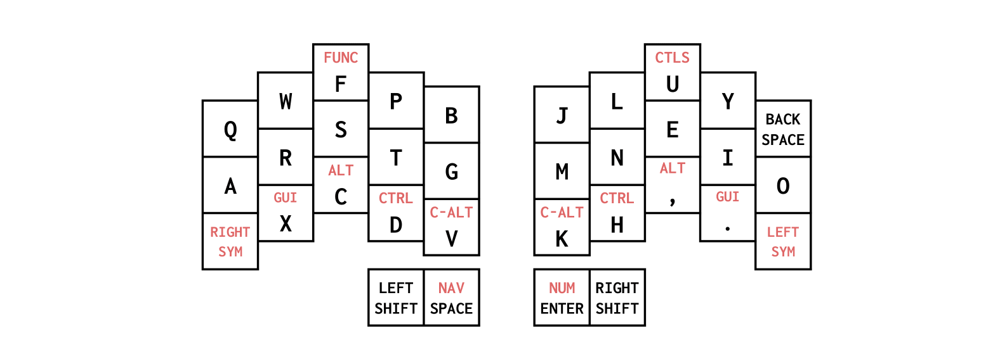
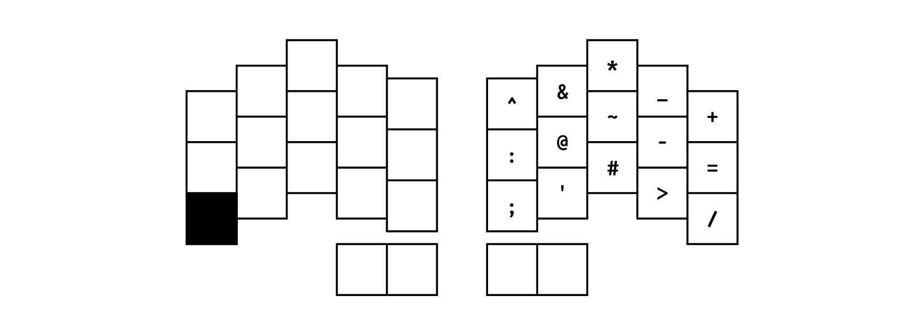
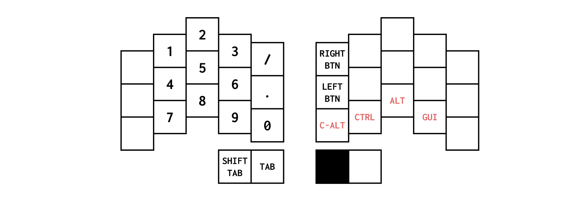
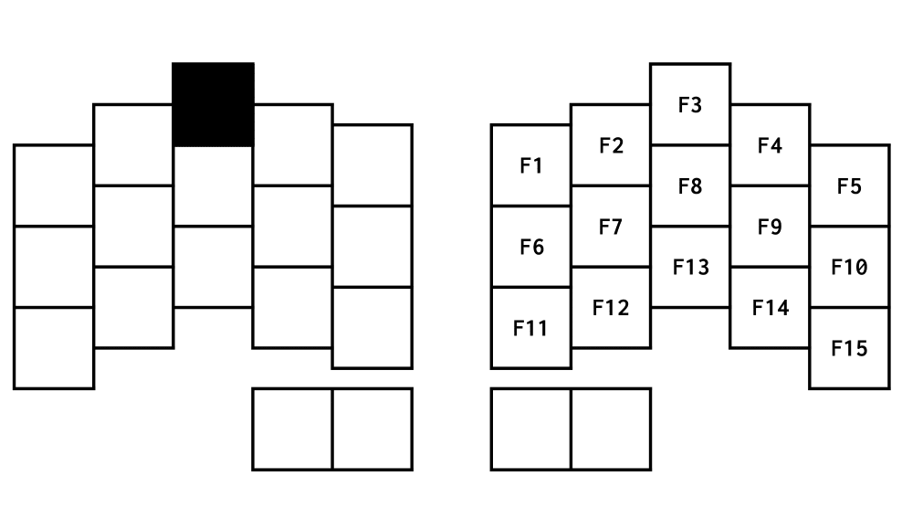

# Hannah's Ferris Sweep Layout

## Introduction

This is a QMK layout designed for the Ferris Sweep based on Colemak-DH with UK
ISO symbols. The layout is designed so that layer keys and modifiers will only
affect the opposite side of the keyboard.

## Usage

Clone this repository into the `users/hbmorrison/` folder inside the QMK
firmware folder then run the `install_keymaps.sh` script to install the keymap
in the correct place under the QMK `keyboards/` folder.

Compile the firmware by running:

```
qmk compile -kb ferris/sweep -e CONVERT_TO=rp2040_ce
```

## Core Functionality



The base layer implements the Colemak-DH layout. When tapped, the thumb keys
produce, from left to right: a oneshot `Left Shift`, `Space`, `Enter`, and a
oneshot `Right Shift`. Double tapping either of the shift keys enable the QMK
Caps Word feature for a short while. Double tapping either shift key again will
toggle Caps Word off.

The thumb keys give access to most of the layers when held down, from left to
right: the left symbol layer, the navigation layer, the number layer, and the
right symbol layer.

Function keys can be accessed on the right side of the keyboard by holding down
the `F` key.

Controls for brightness, sound and media can be accessed on the left side of the
keyboard by holding down the `U` key.

## Symbol Layers

The symbols associated with the shifted number keys on the top row of both
symbol layers, close to their UK ISO finger positions.




The pairs of unshifted and shifted symbols that would normally appear on the
right side of a UK ISO keyboard are on the right symbol layer. The `Del` key is
available at the top right, mirroring where the `Backspace` key appears in the
base layer.

The left symbol layer gathers the brackets, braces and parentheses. The
backslash and pipe symbols appear on the left, echoing where that key appears on
a UK ISO keyboard.

## Navigation Layer


The navigation layer arranges navigation related keys together on the right
side, including the arrow keys, the `Home`, `Page Down`, `Page Up` and `End`
keys as well as a number of shortcut keys for desktop actions.

## Number Layer



The number layer arranges the number keys on the left side in keypad format,
with `1` at the top left.

## Function Key Layer



## Controls Layer


